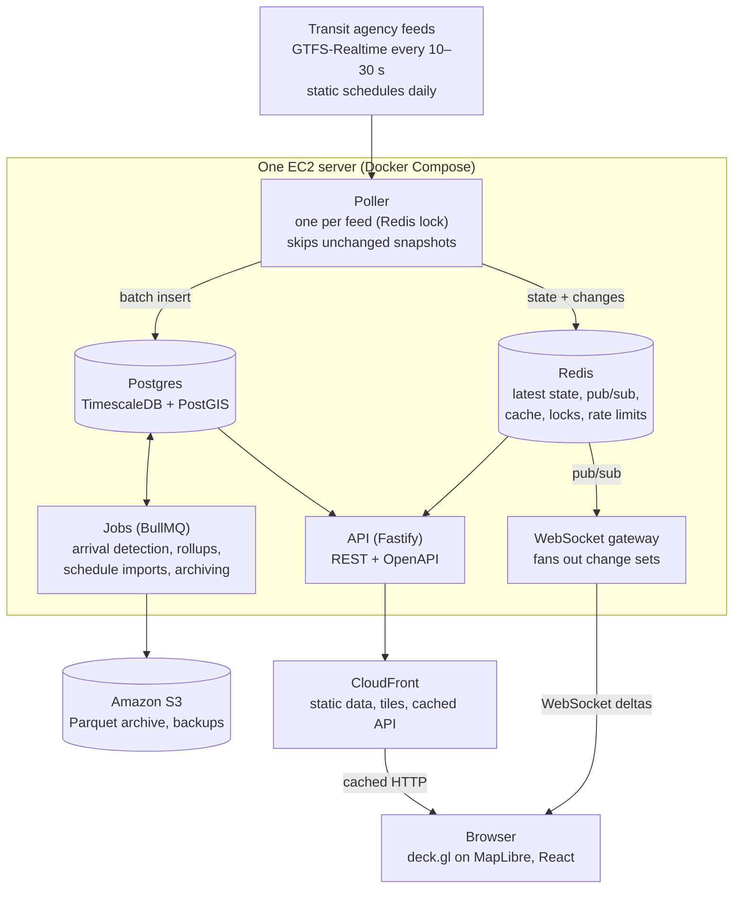

# Headway: Project Spec

As of Sep 29, 2026. The living version of this spec is the Claude doc "Headway — Project Spec & Roadmap"; this file is the repo copy that Claude Code reads. Roadmap and checklists: [roadmap.md](roadmap.md).

## Overview

Headway is a live transit map plus a reliability scorecard: it shows every bus and train moving in real time, and measures how well each route actually keeps its schedule. The plan runs 13 weeks at full effort: a public live map for one city by November 1, 2026, and the finished multi-city version with reliability scorecards, arrival predictions and a published analysis by December 31, 2026.

**Pitch:** See every bus in the city right now, and which routes you can actually trust.

**Goals**

1. A live map of every vehicle in one city, then at least 3 cities by December.
2. Reliability analytics per route and stop: on-time performance, even spacing between buses, bunching, and missing trips.
3. Arrival predictions that are measured against the agency's own predictions.
4. Production-grade engineering: CI/CD, infrastructure as code, monitoring, and load-tested real-time delivery.
5. Real users and a published write-up of what the data shows.

**Non-goals**

- Trip planning or routing (open-source tools like OpenTripPlanner already do this).
- Native mobile apps. The web app is responsive and installable as a PWA.
- Fares, ticketing, or tools for agency staff.

**Success metrics** (targets to hit and measure, not predictions)

| Metric | Target |
| --- | --- |
| Freshness: agency feed update to user's screen | p95 under 5 s |
| Live connections on one server | 1,000 concurrent WebSocket clients, p95 broadcast under 250 ms |
| Cached API response time | p95 under 100 ms |
| Cache hit rate on stats endpoints | Over 90% |
| Ingestion reliability | 99% of polls succeed each month |
| Arrival predictions | Lower average error than the agency's predictions at 5 to 15 minutes out |
| Adoption | 100 weekly users and one published analysis |

## Features & scope

The MVP is the live map for one city; reliability analytics come next, because they are what no existing app offers. Users: riders (where is my bus, which route can I trust), transit advocates and journalists (route scorecards, data exports), and recruiters (the demo).

| Feature | Main users | Phase |
| --- | --- | --- |
| Live map of every vehicle, colored by route, animated between updates | Riders | 2 |
| Route filter and vehicle details (route, direction, delay, last update) | Riders | 2 |
| Stop page with next arrivals from the agency's predictions | Riders | 2 |
| Freshness badge ("data 12 s old") and feed-down banner | Everyone | 2 |
| Route scorecard: on-time %, spacing regularity, bunching, gaps, by hour and weekday | Advocates, riders | 3 |
| Stop reliability: actual typical wait vs. scheduled wait | Riders | 3 |
| Citywide ranking of most and least reliable routes | Journalists | 3 |
| City switcher with 3+ cities | Everyone | 4 |
| Public feed-health status page | Everyone | 4 |
| Headway's own arrival predictions, measured against the agency's | Riders | 4 |
| Replay of a full day as a timelapse | Everyone | 5 |
| Accounts, saved stops, and delay alerts by web push | Riders | Stretch |
| Data export (CSV, Parquet) and a public API | Advocates | Stretch |
| Detection of detours and service changes | Advocates | Stretch |

Stretch items wait until after December 31; the 13-week plan does not depend on them.

## Data sources

Start with Orange County's OCTA: its real-time feeds are public, need no signup, and tag every bus with its trip, and it is local, so the map can be checked against a real bus stop. Every city needs two kinds of data:

- **Static GTFS:** a zip of routes, stops, route shapes and timetables, republished every few weeks.
- **GTFS-Realtime:** protobuf feeds polled every 10 to 30 s. VehiclePositions (where each vehicle is), TripUpdates (the agency's arrival predictions), and Alerts.

| City and agency | Real-time access | Why it's on the list | Phase |
| --- | --- | --- | --- |
| Orange County, [OCTA](https://www.octa.net/about/about-octa/open-data/) | Public URLs for VehiclePositions, TripUpdates and Alerts, in protobuf over HTTPS; free for non-commercial use | Local, no key, and every bus carries a trip ID (about 320 buses on a weekday afternoon) | 1 |
| Boston, [MBTA](https://github.com/mbta/gtfs-documentation/blob/master/reference/gtfs-realtime.md) | Public URLs for VehiclePositions, TripUpdates and Alerts, in protobuf and JSON | Backup if OCTA's feed fails, and a clean, well-documented city to add later | Backup |
| New York, [MTA Bus Time](https://bustime.mta.info/wiki/Developers/GTFSRt) | Free developer key | Largest bus fleet: the real scale test | 4 |
| SF Bay Area, [511](https://511.org/open-data/transit) | Free token; one regional feed covers 30+ agencies; default limit 60 requests per hour | Many agencies through one integration; request a higher limit early, since 60 per hour allows one poll a minute | 4 |
| Los Angeles, [Metro](https://developer.metro.net/) | GTFS-Realtime for bus and rail exists through Swiftly and needs an API key; Metro's own API returned no live vehicles when tested on Sep 29 | Largest fleet in the region. If access isn't granted, use Foothill Transit or Riverside Transit (open feeds, see [feeds/socal.md](feeds/socal.md)) | 4 |

More cities come from the [Mobility Database](https://mobilitydatabase.org/about), a free catalog of 6,000+ transit feeds across 99+ countries, with an API.

**Rules for using feeds**

- Follow each agency's license, and credit the agency in the map footer.
- Never poll faster than a feed updates. Compare the feed's header timestamp and skip unchanged snapshots.
- Store the feed's own timestamps as well as your receive time.

**Feed problems to design for from day 1**

- Repeated snapshots and stale positions with an old timestamp.
- Vehicles with no trip (out of service or returning to the garage).
- Trip IDs that stop matching the schedule after a service change. Re-import static GTFS daily and keep versions.
- GTFS service days that run past midnight (times like 25:30:00) and time-zone mistakes.
- Feed outages. Record them as gaps so analytics never count an outage as missing buses.

## System architecture

One server runs two paths: live positions go from the poller through Redis to the WebSocket gateway within seconds, while history goes into Postgres, where background jobs turn it into arrivals and scorecards.



To scale, run more API and gateway containers; the poller stays one per feed, and Redis pub/sub keeps every gateway in sync.

## Tech stack

| Layer | Choice | Why |
| --- | --- | --- |
| Language | TypeScript on Node.js (current LTS, 24) | One language end to end; shared types between server and client |
| Repo | pnpm workspaces + Turborepo monorepo | Feed schemas and API types shared by every package |
| Feed parsing | gtfs-realtime-bindings (protobuf) | Official GTFS-Realtime bindings |
| API | Fastify | Fast, schema validation, OpenAPI docs generated from schemas |
| Live gateway | ws, with Redis pub/sub between gateway instances | The fan-out story interviewers ask about |
| Background jobs | BullMQ on Redis | Daily schedule imports and rollups, with retries and backoff |
| Database | PostgreSQL + TimescaleDB + PostGIS | Time series (compression, continuous aggregates) and geometry in one database |
| Cache and live state | Redis | Latest vehicle state, pub/sub, response cache, rate limits |
| Raw archive | Amazon S3, Parquet files | Cheap permanent history, queryable with DuckDB |
| Analysis | SQL for production metrics; DuckDB + Python notebooks for the write-up | Production stays in one language; exploration stays fast |
| Frontend | React + Vite, TanStack Router and Query, Zustand | Clear split between server state and UI state |
| Map | deck.gl on MapLibre GL, OpenFreeMap or Protomaps tiles | WebGL for thousands of moving points; no per-map-load fees |
| Infrastructure | AWS EC2 (ARM), S3, CloudFront, Terraform, Docker Compose, Caddy for HTTPS | Real cloud and infrastructure-as-code experience at student cost |
| CI/CD | GitHub Actions, images in GitHub Container Registry, blue-green deploys | Zero-downtime deploys you can explain |
| Observability | Prometheus + Grafana, Sentry | Standard metrics stack; Sentry is free through the GitHub Student Pack |
| Testing | Vitest, Testcontainers, Playwright, k6 | Unit, real-database integration, browser, and load tests |

## Data model & storage

Raw positions are the only big table, so they get short retention in Postgres and permanent storage as Parquet in S3; everything the product shows comes from much smaller derived tables. Start recording raw data in week 2, before the analytics exist: history you never recorded cannot be analyzed later.

| Table | Holds | Key | Kept for |
| --- | --- | --- | --- |
| agencies | Name, time zone, feed URLs, license, poll interval | agency_id | Forever |
| gtfs_versions | Each static schedule import, its file hash and valid dates | version_id | Forever |
| routes, stops, trips, stop_times, shapes | The static schedule, per version; stops and shapes as PostGIS geometry | (version_id, GTFS id) | While referenced |
| vehicle_positions (hypertable) | One row per vehicle per feed update: position, bearing, trip, route, feed time, receive time | (agency_id, vehicle_id, feed_ts); duplicates dropped on insert | 14 days in Postgres, compressed after 1 day; forever as Parquet in S3 |
| stop_arrivals (hypertable) | Detected arrival at each stop: actual time, scheduled time, delay, detection method | (agency_id, service_date, trip_id, stop_sequence) | Forever |
| route_stats_hourly (continuous aggregate) | On-time %, headway percentiles, bunching count per route, stop, direction and hour | (route_id, stop_id, direction, hour) | Forever |
| predictions_log (hypertable) | Every prediction made, Headway's and the agency's, with its horizon | (agency_id, trip_id, stop_id, made_at, source) | 90 days |
| feed_polls | Each poll: status, latency, bytes, vehicle count, feed age | (agency_id, feed, polled_at) | 30 days |

**Sizing.** Estimate raw rows per day per city with:

```math
\text{rows per day} = \text{vehicles in service} \times \frac{86{,}400}{\text{vehicle update interval (s)}}
```

For example, 1,000 vehicles updating every 15 s is 5.76 million rows a day, about 520 million over 13 weeks. Measure real bytes per row and the compression ratio in week 3, then set retention from those numbers, not from guesses.

**Write rules**

- Inserts are idempotent (`ON CONFLICT DO NOTHING`), so a retried poll never double-counts.
- Batch inserts per poll (one statement per snapshot), never row by row.
- Every query on raw data filters by time first, so it only touches recent chunks.

## Real-time delivery & caching

Clients load one cached snapshot over HTTP, then receive only changes over a WebSocket; every cache lifetime matches how often its data can actually change. That keeps server load flat as users grow, which is the claim the load test must prove.

**Live path**

1. The poller fetches a feed, skips it if the header timestamp has not changed, and computes which vehicles moved, appeared or disappeared.
2. It writes the latest state to Redis (one hash per city, stamped with a version number) and publishes the change set on a Redis channel for that city.
3. Each gateway instance subscribes to the channels its clients need and broadcasts the change set. Any number of gateway instances can run behind the load balancer.
4. A new client fetches `/vehicles` (cached, with an ETag), then opens the socket and applies deltas from that version on.
5. If a client sees a version gap after reconnecting, it asks for a resync and gets a fresh snapshot.

**Slow clients.** Live positions are latest-wins data. If a socket's send buffer passes a threshold, the gateway drops queued deltas and sends one fresh snapshot instead of letting memory grow.

**Caching by layer**

| Data | Where it's cached | Lifetime and invalidation |
| --- | --- | --- |
| Static schedule (routes, stops, shapes) | CloudFront, browser | Immutable, versioned URLs; cached for a year, new version = new URL |
| Frontend assets and map tiles | CloudFront, browser | Content-hashed files, cached for a year |
| Vehicle snapshot | Redis, then CloudFront with ETag | Replaced every poll; max-age 5 s |
| Stop arrival predictions | Redis | Expires at the feed's update interval (about 15 s) |
| Route scorecards and rankings | Redis, then CloudFront | Recomputed hourly; max-age 5 min with stale-while-revalidate 1 h |
| Feed health | Redis | Written on every poll |

**Protection**

- Cache stampedes: on a miss for an expensive query, one request recomputes behind a short Redis lock while others wait or get stale data.
- Rate limiting: a token bucket per IP in Redis on the public API.
- Upstream politeness: one poller per feed across the whole system, enforced with a Redis lock, so scaling workers never multiplies requests to an agency.

## Frontend & state management

The key decision: live vehicle positions never go through React state. They change thousands of times a minute, so they live in a plain store that the WebGL map reads directly, and React re-renders only when the user does something.

| State | Lives in | Why |
| --- | --- | --- |
| Live vehicles | A mutable Map outside React, updated by the socket handler | deck.gl reads it every frame; no re-render per update |
| Server data (routes, stops, scorecards) | TanStack Query | Caching, refetching and loading states; stale times match the server's cache lifetimes |
| UI state (selected vehicle, filters, open panel) | Zustand | Small, explicit, easy to test |
| Shareable state (city, route, stop, time window) | URL search params via TanStack Router | Every view is a link people can share |

**Smooth motion.** Each vehicle keeps its last two positions. A requestAnimationFrame loop moves it along its route between them, so buses glide instead of jumping every 15 s.

**Pages**

- Map (home): live vehicles, route filter, vehicle panel, freshness badge.
- Route: scorecard, headway chart by hour, worst stops.
- Stop: next arrivals, typical wait vs. scheduled wait.
- Rankings: most and least reliable routes in the city.
- Status: feed health for every city.
- Methodology: how each metric is calculated.

**Performance and access targets**

- 60 fps with 5,000 vehicles on a mid-range laptop.
- Map usable within 2.5 s on a mid-range phone over 4G.
- A list view of vehicles and arrivals for keyboard and screen-reader users, since a map alone is not accessible.
- Installable as a PWA, with the app shell cached for offline start.

## Reliability analytics & ETA prediction

Everything starts with arrival detection: turning GPS pings into "bus X reached stop Y at 8:14:32." Every metric and the prediction model are built on those arrival records, so this is the part to test hardest.

**Arrival detection**

1. Project each position onto its trip's route shape (PostGIS `ST_LineLocatePoint`) to get distance along the route.
2. Each stop also has a distance along the shape. When two pings straddle a stop, interpolate the arrival time between them.
3. Reject pings that jump backward or sit far off the shape (GPS noise, detours), and mark trips with too many gaps as incomplete.
4. Check a sample against the agency's own past arrival times where the feed provides them, and publish the error.

**Metric definitions** (all thresholds configurable per agency)

| Metric | Definition | Used for |
| --- | --- | --- |
| On-time performance | Share of departures from timed stops between 1 min early and 5 min late (a common US window) | Routes that run on a timetable |
| Headway regularity | Coefficient of variation of the actual gaps between buses at a stop | Frequent routes, where riders don't check the timetable |
| Bunching | Two buses of the same route and direction arriving less than 25% of the scheduled gap apart | Route scorecards, rankings |
| Missing trip | A scheduled trip with no vehicle seen while the feed was healthy | "Ghost bus" counts |
| Excess wait time | Average wait riders actually face minus the wait the schedule promises | The single rider-centered number per route |

For riders arriving at random, average wait depends on how uneven the gaps are, not just their average (h = each gap between consecutive buses):

```math
\text{average wait} = \frac{\sum_i h_i^2}{2 \sum_i h_i} \qquad \text{excess wait} = \text{average wait}_{\text{actual}} - \text{average wait}_{\text{scheduled}}
```

This is why bunching hurts riders even when the average frequency looks fine.

**Arrival predictions**

| Model | How it works |
| --- | --- |
| Agency prediction | From the feed's TripUpdates; the benchmark to beat |
| Schedule + current delay | Scheduled time plus the vehicle's current delay; the simplest baseline |
| Headway model | Now + median travel time for each remaining stop-to-stop segment, by route, direction and hour of week; the 10th to 90th percentile gives a likely range |

**Evaluation.** Log every prediction from every model at horizons of 1 to 30 minutes, then join each to the actual arrival. Report average error and 90th-percentile error by horizon, and how often the actual arrival lands inside the predicted range. Train on earlier weeks and test on the following week, never on mixed dates, so the model can't peek at the future.

## API design

A small versioned REST API for everything cacheable, plus one WebSocket for live positions. OpenAPI docs are generated from the Fastify schemas, so the docs can't drift from the code.

| Endpoint | Returns | Cache |
| --- | --- | --- |
| `GET /v1/cities` | Cities, their agencies, feed status | CDN, 1 h |
| `GET /v1/cities/{city}/static/{version}/routes.json` (also stops, shapes) | Static schedule data for the map | Immutable |
| `GET /v1/cities/{city}/vehicles` | Snapshot of all vehicles plus its version | ETag, 5 s |
| `GET /v1/cities/{city}/stops/{stopId}/arrivals` | Next arrivals: agency and Headway predictions | Redis, about 15 s |
| `GET /v1/cities/{city}/routes/{routeId}/scorecard?window=7d` | Reliability metrics by hour and weekday | CDN, 5 min + stale-while-revalidate |
| `GET /v1/cities/{city}/rankings?metric=excess_wait&window=30d` | Routes ranked by one metric | CDN, 5 min + stale-while-revalidate |
| `GET /v1/status` | Health of every feed | 10 s |
| `WS /v1/live?city={city}` | Live change sets | None |

**WebSocket messages**

| Direction | Type | Contents |
| --- | --- | --- |
| Client to server | `subscribe` | City, optional map bounds to limit traffic |
| Server to client | `delta` | Version, previous version, changed vehicles, removed vehicle IDs |
| Server to client | `resync` | Tells the client to refetch the snapshot after a gap or overload |
| Both | `ping` / `pong` | Heartbeat every 20 s; missing two closes the socket |

Errors use one JSON shape (`code`, `message`, `requestId`) everywhere, and the request ID appears in logs and Sentry, so any user report can be traced.

## Infrastructure, deployment & cost

One ARM server on AWS runs everything in Docker Compose, with CloudFront in front and S3 behind; it costs about $60 a month, which AWS's new-account credits cover for the whole 13 weeks. Everything is defined in Terraform, so moving to a cheaper host after the credits run out is a config change.

**Terraform manages:** the VPC and security group, the EC2 instance and its disk, the S3 bucket with lifecycle rules, an IAM role so the server reaches S3 without stored keys, the CloudFront distribution, DNS, and an AWS Budgets alert.

**Environments:** local (Docker Compose with one recorded city on replay) and production. Pull requests also get a preview build of the frontend.

**Deploy pipeline (blue-green)**

1. A push to main runs lint, type checks, unit tests and integration tests in GitHub Actions.
2. Build ARM images and push them to GitHub Container Registry, tagged with the commit.
3. Run database migrations. They must be backward compatible (expand, then contract), so the old version keeps working.
4. Start the new "green" containers beside the running "blue" ones and wait for health checks.
5. Switch Caddy's upstream to green, run smoke tests, then stop blue. Rollback is switching the upstream back.

**Backups:** nightly database dump to S3, and one full restore drill before launch. Secrets live in GitHub Actions secrets and AWS SSM Parameter Store, never in the repo.

**Monthly cost** (AWS on-demand prices, approximate)

| Item | Cost per month |
| --- | --- |
| EC2 t4g.large, 2 vCPU and 8 GiB ([pricing](https://instances.vantage.sh/aws/ec2/t4g.large)) | About $49 |
| 60 GB gp3 disk | About $5 |
| Public IPv4 address | About $3.60 |
| S3 archive, under 50 GB | About $1 |
| CloudFront | $0 within the always-free allowance |
| Domain and Sentry | $0 through the [GitHub Student Developer Pack](https://education.github.com/pack) |

That is roughly $180 for October through December. New AWS accounts get $100 in credits plus up to $100 more for trying specific services, for up to 6 months ([AWS announcement](https://aws.amazon.com/about-aws/whats-new/2025/07/aws-free-tier-credits-month-free-plan/)). Set the Budgets alert at $50 a month on day 1.

## Testing & observability

The centerpiece is replay testing: record a full day of raw feed snapshots once, then replay it through the whole pipeline in CI at high speed and compare the detected arrivals and metrics with saved expected results. It makes a live, messy data system testable, and it doubles as the local development setup.

| Test layer | Tool | What it covers |
| --- | --- | --- |
| Unit | Vitest | GTFS times past midnight, arrival interpolation, metric formulas, delta computation |
| Replay | Vitest + recorded snapshots in S3 | The full pipeline on a real day of data, with expected arrivals and metrics |
| Integration | Testcontainers | Real Postgres (TimescaleDB, PostGIS) and Redis; migrations, idempotent inserts, cache behavior |
| End to end | Playwright | Map loads, vehicles move, route and stop pages render, deep links work |
| Load | k6 | 1,000+ simulated WebSocket clients and API traffic; results published in the README |

**Metrics to collect (Prometheus + Grafana)**

- Ingestion: poll latency, feed age, vehicles per feed, rows inserted per second, rejected pings.
- Live delivery: connected clients, broadcast latency, message size, resyncs, dropped deltas.
- API: request rate, p50/p95/p99 latency, cache hit rate by endpoint, error rate.
- System: CPU, memory, disk use, database size by table, Redis memory.

**Alerts**

- A feed is older than 2 minutes, or polls fail 5 times in a row.
- Disk above 80% or database growth faster than expected.
- API error rate above 1% for 5 minutes.
- HTTPS certificate expires within 14 days.

**Service targets:** freshness p95 under 5 s, and 99.5% monthly availability for the map. The public Status page shows feed health, so outages are visible to users, not hidden.

## Risks & mitigations

The biggest risk is scope, not technology: 13 weeks is tight, so the cut list is decided now, before it's needed.

| Risk | Early warning sign | Mitigation |
| --- | --- | --- |
| Scope outgrows 13 weeks | A phase gate slips by more than 3 days | Cut in this order: replay timelapse, then the third city, then the Headway prediction model (keep the agency benchmark and baselines) |
| Arrival detection is inaccurate | Arrivals out of order, many incomplete trips | Validate against the agency's past arrival times; publish the error rate instead of hiding it |
| A feed changes format or goes offline | Feed-age alerts, parse errors | Per-agency adapters, recorded gaps, and more than one city so the demo never depends on one feed |
| Disk fills with raw data | Database growth alert | Compression after 1 day, 14-day raw retention, Parquet archive in S3 |
| 511 rate limit blocks the Bay Area | Rejected requests | Request a higher limit in week 1; swap in another city if it doesn't come through |
| Midterms and finals eat build time | Weekly hours drop | Lighter weeks are built into the plan; the week before each gate is buffer |
| Surprise AWS bill | Budgets alert | One server, alert at $50 a month, no managed database or NAT gateway |
| Burnout from going all in | Skipped planning, no weekly demo | One full day off a week and a short written demo every Sunday |

## Portfolio & hiring plan

A recruiter spends seconds on a project, an interviewer spends 30 minutes, and each needs something different. Build for both from week 1: capture metrics as you go, and keep a decision log you can turn into interview answers.

**For the recruiter's first 10 seconds**

- A live link that works on a phone.
- A 20-second GIF at the top of the README: vehicles moving, click a route, the scorecard opens.
- One line with real numbers: cities, vehicles tracked, rows ingested, concurrent clients tested.

**README structure**

1. What it is and the live link.
2. Demo GIF and a 90-second video.
3. Architecture diagram.
4. Key decisions and tradeoffs.
5. Load-test and production numbers, with how they were measured.
6. How to run it locally with one command, using a recorded day of data.

**Decisions to be ready to defend** (log them in `docs/decisions/` as you make them)

- Snapshot plus deltas instead of sending full state every update.
- Dropping deltas for slow clients (latest-wins) instead of buffering.
- TimescaleDB with a short raw retention and an S3 archive, instead of keeping everything in Postgres.
- Keeping live positions out of React state.
- Expand-then-contract migrations to make blue-green deploys safe.
- Evaluating predictions against the agency, split by time to avoid leakage.

**Resume bullets** (templates: fill the brackets with measured numbers)

- Built a real-time transit platform tracking [N] vehicles across [N] cities, ingesting [N] million GPS updates a day into TimescaleDB with idempotent batch writes.
- Designed WebSocket fan-out over Redis pub/sub with snapshot-plus-delta sync, load-tested to [N] concurrent clients at [N] ms p95 broadcast latency.
- Cut p95 API latency from [N] ms to [N] ms with layered Redis and CDN caching at a [N]% hit rate.
- Built arrival predictions with [N]% lower error than the agency's own at 5 to 15 minutes out.
- Automated zero-downtime blue-green deploys on AWS with Terraform and GitHub Actions.

**Launch**

- Publish one analysis from the data, for example which routes bunch most and what that costs riders in excess wait.
- Share it in transit communities and city subreddits, as a Show HN, and on LinkedIn.
- Keep ingestion running after December so the numbers keep growing while you apply.

## Open decisions

- [ ] Hours per week available. The roadmap assumes about 30; below 20, drop to 2 cities and the baseline predictions only.
- [x] City 1: Orange County (OCTA) instead of Boston; Boston stays as the backup. See [decision 0002](decisions/0002-orange-county-octa-as-city-1.md).
- [ ] LA Metro's live feeds need a Swiftly key. Email Metro's developer contact to ask about individual access; if granted, LA Metro joins in Phase 4.
- [ ] Request a higher 511 rate limit for the Bay Area regional feed.
- [ ] Final name and domain ("Headway" is a working name).
- [ ] Stay on AWS after the credits end, or move to a cheaper server once the build is done.
- [ ] Keep the prediction model in SQL and TypeScript, or train a gradient-boosted model in Python if time allows.

## Sources

- [OCTA open data](https://www.octa.net/about/about-octa/open-data/) and [terms of use](https://www.octa.net/about/about-octa/terms-of-use)
- [MBTA GTFS-Realtime documentation](https://github.com/mbta/gtfs-documentation/blob/master/reference/gtfs-realtime.md)
- [Southern California feed survey](feeds/socal.md)
- [MTA Bus Time GTFS-Realtime](https://bustime.mta.info/wiki/Developers/GTFSRt)
- [511 SF Bay transit open data](https://511.org/open-data/transit)
- [LA Metro developer site](https://developer.metro.net/)
- [Mobility Database](https://mobilitydatabase.org/about)
- [EC2 t4g.large pricing](https://instances.vantage.sh/aws/ec2/t4g.large)
- [AWS Free Tier credits announcement](https://aws.amazon.com/about-aws/whats-new/2025/07/aws-free-tier-credits-month-free-plan/)
- [GitHub Student Developer Pack](https://education.github.com/pack)
